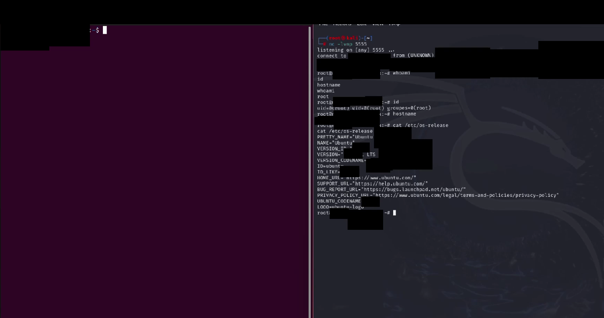
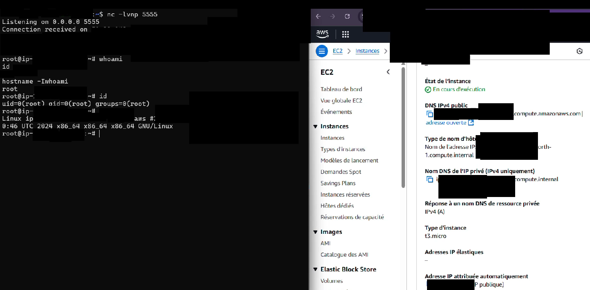
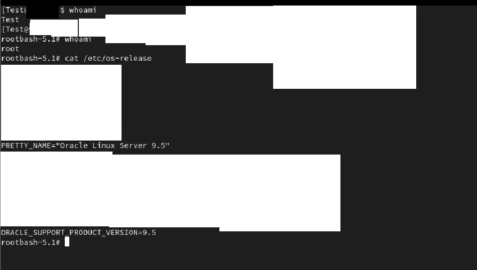
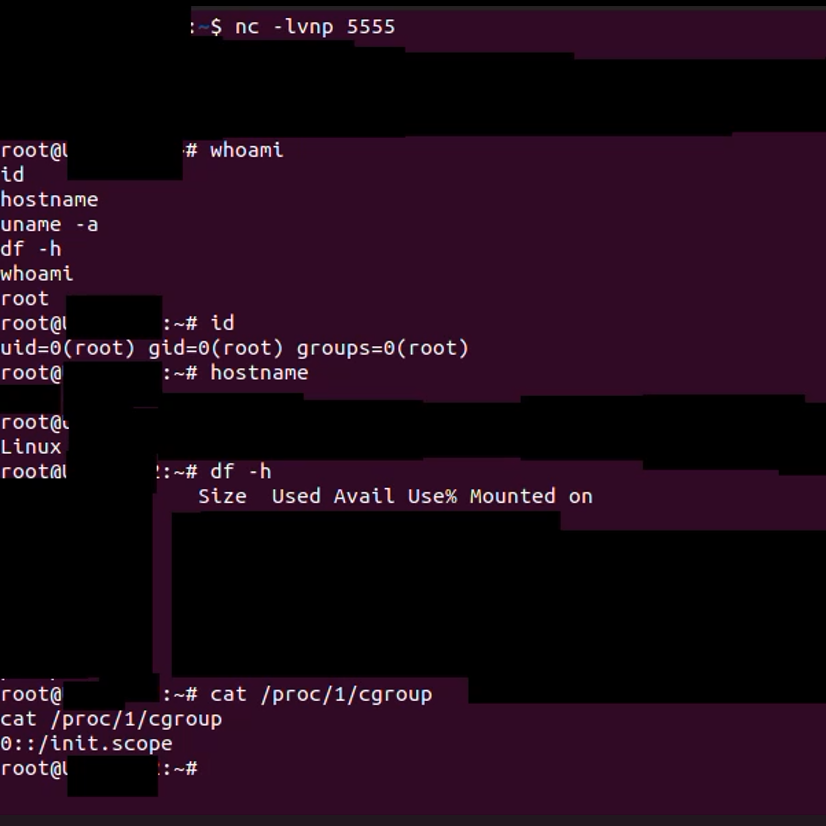
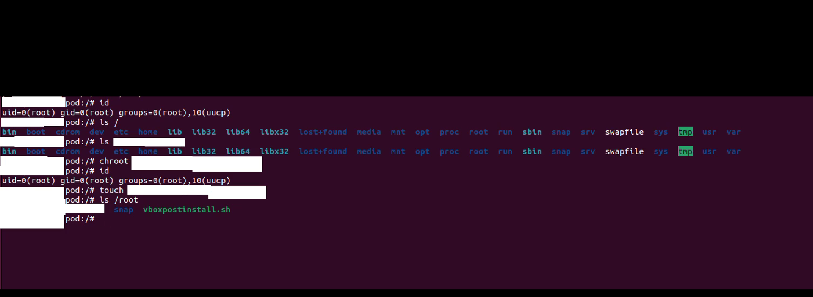

# Linux Privilege Escalation via Cron Job Misconfigurations

> **Disclaimer:**  
> This writeup is for educational and research purposes only.  
> All tests were performed in isolated lab environments.  

[](https://creativecommons.org/licenses/by-nc-sa/4.0/)
[]()
[]()

## 🔍 Overview

This repository contains research, documentation, and tools related to privilege escalation vulnerabilities arising from common cron job misconfigurations in enterprise Linux environments.

**Research Period**: Avril 2025 - July 2025  
**Total Hours**: 200+ hours of systematic analysis  
**Public Disclosure**: December 2025

### Key Findings

- **CVSS 3.1 Score**: 7.8 (HIGH)
- **Attack Vector**: Local (AV:L)
- **Affected Systems**: Ubuntu 22.04 LTS, OpenSUSE Leap 15.x, Oracle Linux 8.x
- **Impact**: Complete privilege escalation from limited user to root

---

## 📋 Table of Contents

- [Background](#background)
- [Vulnerability Details](#vulnerability-details)
- [Affected Systems](#affected-systems)
- [Impact Assessment](#impact-assessment)
- [Mitigation](#mitigation)
- [Tools](#tools)
- [Documentation](#documentation)
- [Responsible Disclosure](#responsible-disclosure)
- [Contributing](#contributing)
- [License](#license)
- [Contact](#contact)

---

## 🎯 Background

System administrators frequently prioritize network perimeter security while local privilege escalation vectors receive less attention. This research systematically examined cron job configurations across multiple Linux distributions to identify common patterns that enable privilege escalation.

### Motivation

After transitioning from a 7-year career in banking to cybersecurity, I focused on practical security issues affecting production environments. This research aims to:

1. Identify widespread misconfiguration patterns
2. Provide actionable mitigation strategies
3. Raise awareness of often-overlooked attack vectors
4. Contribute to enterprise Linux security

---

## 🔓 Vulnerability Details

### Core Issues

The research identified four primary misconfiguration patterns:

#### 1. World-Writable Script Paths

Cron jobs executing scripts in directories with overly permissive permissions:

```bash
# Vulnerable cron job (running as root)
*/5 * * * * /opt/scripts/maintenance.sh

# Insecure directory permissions
drwxrwxrwx 2 root root 4096 Dec 01 10:00 /opt/scripts/
```

**Exploitation**: Any user can modify `maintenance.sh` to execute arbitrary commands as root.

#### 2. Relative Path Exploitation

Cron jobs using relative paths instead of absolute paths:

```bash
# Vulnerable cron entry
*/10 * * * * backup_database.sh
```

**Exploitation**: Attacker creates malicious `backup_database.sh` in a PATH directory that gets executed first.

#### 3. Insecure Temporary File Handling

Scripts creating predictable temporary files without proper permissions:

```bash
# Vulnerable pattern
TMPFILE=/tmp/backup_$$.tmp
echo "sensitive_data" > $TMPFILE
# Race condition window here
process_data $TMPFILE
rm $TMPFILE
```

**Exploitation**: Race condition allows attacker to read/modify data or inject malicious content.

#### 4. Environment Variable Injection

Cron jobs relying on user-controllable environment variables:

```bash
# Vulnerable cron job
*/15 * * * * $SCRIPT_PATH/update.sh
```

**Exploitation**: User manipulates `$SCRIPT_PATH` to execute malicious script.

---

## 💻 Affected Systems

### Tested Distributions

| Distribution | Version | Status |
|--------------|---------|--------|
| Ubuntu Server | 22.04 LTS | ✅ Vulnerable |
| OpenSUSE Leap | 15.x | ✅ Vulnerable |
| Oracle Linux | 8.x | ✅ Vulnerable |

**Note**: These patterns are not distribution-specific. Similar misconfigurations likely exist across many other Linux distributions and versions.

### Common Environments

The research focused on configurations typical in:
- Enterprise server deployments
- Cloud instances (AWS EC2, Azure VMs, GCP Compute)
- On-premise data centers
- Development/staging environments

---

## 📊 Impact Assessment

### CVSS 3.1 Breakdown

**Base Score**: 7.8 (HIGH)

**Vector String**: `CVSS:3.1/AV:L/AC:L/PR:L/UI:N/S:U/C:H/I:H/A:H`

| Metric | Value | Explanation |
|--------|-------|-------------|
| Attack Vector (AV) | Local | Requires local system access |
| Attack Complexity (AC) | Low | No special conditions needed |
| Privileges Required (PR) | Low | Basic user account sufficient |
| User Interaction (UI) | None | Fully automated exploitation |
| Scope (S) | Unchanged | Impacts only vulnerable system |
| Confidentiality (C) | High | Complete file system access |
| Integrity (I) | High | Full system modification |
| Availability (A) | High | System disruption possible |

### Real-World Impact

Successful exploitation enables:

- ✅ Root privilege escalation
- ✅ Persistent backdoor installation
- ✅ Sensitive data exfiltration
- ✅ System configuration tampering
- ✅ Lateral movement preparation
- ✅ Command & control establishment

---

## 🛡️ Mitigation

### Immediate Actions

#### 1. Audit Current Cron Jobs

```bash
# List all cron jobs system-wide
sudo ./tools/audit-cron.sh
```

#### 2. Fix Permissions

```bash
# Secure cron script directories
sudo chmod 755 /etc/cron.d /etc/cron.daily /etc/cron.hourly /etc/cron.monthly /etc/cron.weekly
sudo chown -R root:root /etc/cron.*

# Secure individual scripts
find /etc/cron.* -type f -exec chmod 644 {} \;
find /usr/local/bin -type f -exec chmod 755 {} \;
```

#### 3. Use Absolute Paths

Update all cron jobs to use full paths:

```bash
# Before (vulnerable)
*/5 * * * * backup.sh

# After (secure)
*/5 * * * * /usr/local/sbin/backup.sh
```

#### 4. Define Secure PATH

```bash
# Add to crontab
PATH=/usr/local/sbin:/usr/local/bin:/usr/sbin:/usr/bin:/sbin:/bin
*/10 * * * * /usr/local/sbin/maintenance.sh
```

### Long-Term Hardening

See [HARDENING.md](./docs/HARDENING.md) for comprehensive hardening guide including:

- Principle of least privilege implementation
- Secure temporary file creation patterns
- Input validation strategies
- File integrity monitoring setup
- Automated security auditing

---

## 🔧 Tools

This repository includes several security audit tools:

### `/tools/audit-cron.sh`

Comprehensive cron security auditor that checks for:
- World-writable script paths
- Relative path usage
- Insecure script ownership
- Missing permission restrictions
- Unsafe environment variable usage

**Usage**:
```bash
sudo ./tools/audit-cron.sh
```

**Output**: Detailed report with severity ratings and remediation suggestions.

### `/tools/secure-cron-template.sh`

Template for writing secure cron scripts with:
- Secure temporary file creation
- Input validation
- Error handling
- Logging best practices

**Usage**:
```bash
cp tools/secure-cron-template.sh /usr/local/sbin/your-script.sh
# Edit and customize
```

### `/tools/monitor-cron-changes.sh`

File integrity monitoring specifically for cron-related files.

**Usage**:
```bash
# Initial baseline
sudo ./tools/monitor-cron-changes.sh --init

# Check for changes
sudo ./tools/monitor-cron-changes.sh --check
```

---

## 📚 Documentation

### Full Research Paper

The complete technical analysis is available in:
- [Medium Article](coming soon)
- [PDF Download](./docs/LPE-Cron-Research-Full.pdf)

#### Custom SUID-root Shell (rootbash)

During research, a custom SUID-root shell binary (“rootbash”) was discovered and analyzed via Ghidra. 
Unlike standard shells, rootbash bypasses all user validation, directly invoking execve() and relaunching itself on failure—making it a persistent privilege escalation vector. 
The binary is not a known public tool, and appears to be custom-built or repackaged.

See [docs/ROOTBASH_ANALYSIS.md](./docs/ROOTBASH_ANALYSIS.md) for full static and dynamic analysis.


### 📸 Screenshots

All screenshots below are fully sanitized for privacy and security.
- No real credentials or sensitive information is displayed.
- Only demonstration environments were used (cloud labs, local VMs, test instances).
- For educational purposes only.

| Platform         | Screenshot Example              |
|------------------|--------------------------------|
| Ubuntu LPE       |  |
| AWS EC2 Root     |  |
| Oracle Linux LPE |  |
| Docker Escape    |  |
| MicroK8s Pod     |  |


### Additional Resources

- **[HARDENING.md](./docs/HARDENING.md)**: Comprehensive hardening guide
- **[FAQ.md](./docs/FAQ.md)**: Frequently asked questions


---

## 🔒 Responsible Disclosure

### Timeline

- **May 2025**: Initial discovery
- **Avril-August 2025**: Research, testing, documentation
- **December 2025**: Public disclosure

### Vendor Notification

As these findings represent configuration patterns rather than software vulnerabilities:

- Ubuntu Security Team: Notified for documentation purposes
- SUSE Security Team: Notified for documentation purposes
- Oracle Linux Security: Notified for documentation purposes

All vendors acknowledged these as common misconfiguration patterns rather than distribution-specific bugs.

### CVE Status

These issues do not warrant individual CVE assignments as they represent configuration problems rather than software vulnerabilities. Organizations should treat them as high-priority security configuration items in their hardening baselines.

---

## 🤝 Contributing

Contributions welcome! Please see [CONTRIBUTING.md](./CONTRIBUTING.md) for guidelines.

### Areas for Contribution

- Additional vulnerable configuration patterns
- Distribution-specific findings
- Improved detection scripts
- Hardening automation
- Case studies from real-world deployments

### How to Contribute

1. Fork this repository
2. Create a feature branch (`git checkout -b feature/new-pattern`)
3. Commit your changes (`git commit -am 'Add new vulnerability pattern'`)
4. Push to the branch (`git push origin feature/new-pattern`)
5. Open a Pull Request

---

## 📜 License

This work is licensed under [Creative Commons Attribution-NonCommercial-ShareAlike 4.0 International (CC BY-NC-SA 4.0)](https://creativecommons.org/licenses/by-nc-sa/4.0/).

**You are free to:**
- Share: Copy and redistribute the material
- Adapt: Remix, transform, and build upon the material

**Under the following terms:**
- Attribution: Give appropriate credit
- NonCommercial: Not for commercial purposes
- ShareAlike: Distribute under the same license

---

## ⚠️ Disclaimer

**FOR EDUCATIONAL AND DEFENSIVE SECURITY PURPOSES ONLY**

This research and associated tools are provided for:
- Educational purposes
- Defensive security hardening
- Security awareness
- Penetration testing in authorized environments

**Unauthorized testing of systems you do not own or have explicit permission to test is illegal.**

The author assumes no liability for misuse of this information.

---

## 👤 Author

**Nelson Adhepeau**  
Security Researcher

### Background

After a 7-year career in banking and finance, I completed a formal cybersecurity training at Datascientest (CyberUniversity, ECE Engineering School), 
and specialized in offensive research through self-study, practical audits, and exploit developmen. My focus areas include:

- System-level security analysis
- Privilege escalation techniques
- Configuration security
- Responsible disclosure

### Connect

- **LinkedIn**: https://www.linkedin.com/in/nelson-adhepeau/
- **Email**: privexploits@protonmail.com
- **Medium**: coming soon
### Currently Seeking

Open to opportunities in:
- Security Research
- Penetration Testing
- Application Security Engineering
- Security Consulting

**Location**: Remote work preferred (global)

---

## 📬 Contact

For questions, collaborations, or security inquiries:

- **Email**: privexploits@protonmail.com


**Response Time**: Typically within 24-48 hours

---

## 🙏 Acknowledgments

Thank you to:
- The Linux security community for ongoing education
- Distribution security teams for collaborative dialogue
- Early reviewers who provided feedback on this research
- Organizations committed to security transparency

---

## 📊 Repository Statistics


---

## 📅 Changelog

### Version 1.0.0 (December 2025)
- Initial public release
- Complete research documentation
- Audit tools v1.0
- Hardening guidelines

---

**Star this repository if you find it useful!** ⭐

**Share to help improve Linux security across the industry.** 🔐

---

© 2025 Nelson Adhepeau | Licensed under CC BY-NC-SA 4.0

